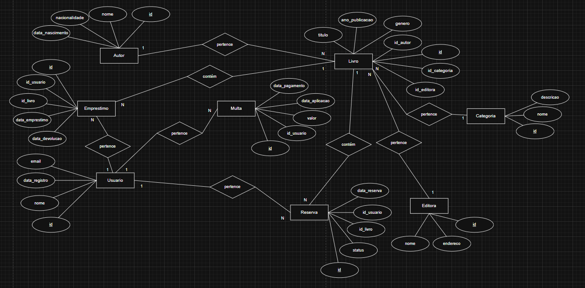
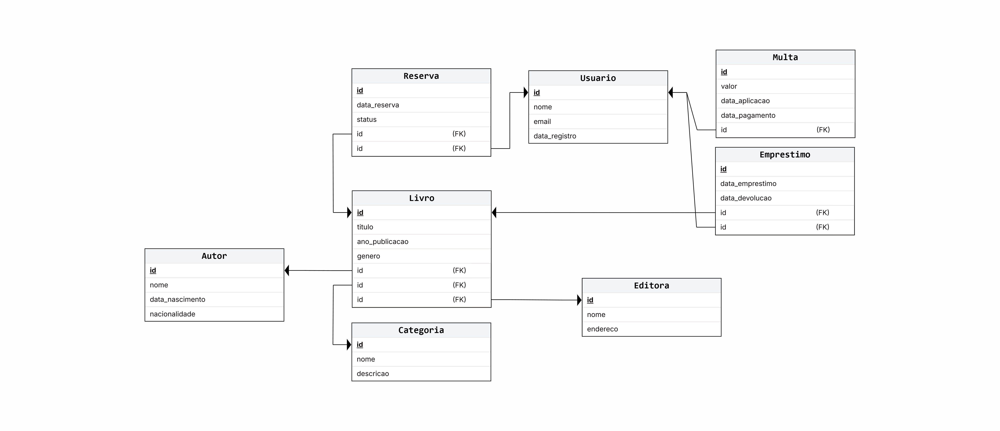

# Atividade Fixação

## Fase 1 - Diagrama Conceitual (ER)

## Fase 2 - Diagrama Lógico (Relacional)

## Fase 3 - Físico (DDL, DML)
[Arquivo DDL](./fisico/ddl.sql)

[Arquivo DML](./fisico/dml.sql)

## Fase 4 - CLI
[CLI com comandos PostgreSQL](./CLI/cli.py)

### Definir variáveis de ambiente
$env:PGHOST="localhost"

$env:PGDATABASE=""

$env:PGUSER=""

$env:PGPASSWORD=""

$env:PGPORT="5432"

ou

setx PGHOST "localhost"

setx PGDATABASE "biblioteca"

setx PGUSER "postgres"

setx PGPASSWORD "postgres"

setx PGPORT "5432"